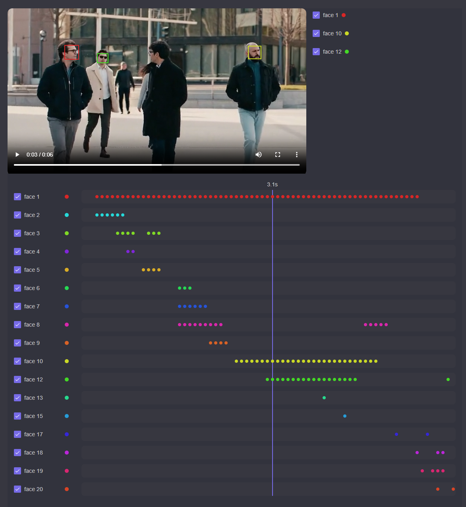

# 🎥 VideoAnonymizer

> Privacy-first video anonymization powered by Computer Vision

Automatically detect and anonymize sensitive information in videos — such as faces, license plates, or other identifiable objects — using a modern, scalable architecture.

---

## ✨ Features

- 🎯 Automatic face detection (powered by RetinaFace)
- 🎬 Video anonymization by blurring sensitive regions
- ⚡ Asynchronous processing with RabbitMQ
- 🌐 Web-based UI built with Blazor and Vue
- 🧠 Python AI service based on FastAPI
- 🧩 Modular distributed architecture with .NET Aspire
- 🔌 Designed for local and cloud deployment

---

## 🎞️ Demo

### Before / After
Automatically anonymized faces in a sample video:


### 🧩 Review Tool (Work in Progress)

The review tool allows inspecting detected objects before anonymization.



Current capabilities:

- Inspect detected faces directly in the video preview
- Visualize object occurrences on a timeline
- Deselect objects from anonymization
- Review tracked objects with consistent colors across the UI

Current limitations:

- No manual creation of new objects yet
- No moving or resizing of bounding boxes yet

The current review tool is intended to evolve into a full editor with manual object creation and adjustment capabilities.

#### Rendering approach

For performance reasons, the review tool is implemented using Vue and browser APIs such as `requestVideoFrameCallback`.

The rest of the UI is Blazor-based.

---
### ⚠️ Known limitations

The anonymization pipeline is currently not fully reliable.

- Visual artifacts may occur in the generated video
- In some cases, deselected objects are still partially blurred

This is the next area of focus and will be improved in upcoming iterations.

---

## 🏗️ Architecture Overview

The system is built as a distributed service architecture with the following main components:

- **webfrontend** – Blazor WebAssembly UI with a Vue-based review tool for high-performance rendering
- **apiservice** – .NET backend exposing a JSON API
- **video processor** – background worker for frame extraction, blurring, and video generation
- **objectDetection** – Python FastAPI service for object detection
- **RabbitMQ** – asynchronous job queue
- **PostgreSQL** – storage for metadata, analysis results, and processing state
- **modeldownloader** – startup component that ensures the required AI model is available
- **database migration service** – applies schema migrations automatically on startup

The architecture is designed to scale individual components (e.g. AI processing) independently. The frontend combines Blazor for general application structure with Vue for performance-critical UI components.

### Processing Flow

1. The user uploads a video through the frontend.
2. The API stores metadata and creates a processing job.
3. The job is published to RabbitMQ.
4. The video processor consumes the job and extracts frames.
5. The processor sends frames to the Python detection service.
6. Detected regions are returned and blurred in the video.
7. The processed video is reassembled and stored.
8. The user can download the anonymized result.

---

## 🔌 API Overview

The backend exposes a REST-like JSON API for asynchronous video processing workflows.

### Endpoints

```http
POST   /upload
POST   /analyze/{videoId}
POST   /anonymize/{videoId}
GET    /analyzed/{videoId}
```

### Typical Flow

✔ Actual flow (today)
```text
1. Upload a video
2. Start analysis
3. Review detected objects
4. Start anonymization
5. Download the processed video
```
🚧 Planned (Review Tool → Editor)
```text
1. Upload a video
2. Start analysis
3. Review detected objects
4. Edit objects / areas to anonymize
5. Start anonymization
6. Download the processed video
```

---

## 🚀 Getting Started

### Requirements

- .NET 10
- Python 3.10+
- Docker
- GPU (optional, for faster inference)
- A development HTTPS certificate may be required:
```bash
dotnet dev-certs https --trust
```

### Platform Notes
The current development setup is primarily tested on Windows.
The video processing component currently depends on native OpenCvSharp runtime support and is not fully configured for Linux/WSL yet.


### Clone the repository

```bash
git clone https://github.com/Imagonix/VideoAnonymizer.git
cd VideoAnonymizer
```

### First-time setup

Initialize development secrets:

```bash
./setup-dev.ps1
```

### Start the application

```bash
dotnet run --project VideoAnonymizer.AppHost
```

This starts the distributed application, including:

- frontend
- API
- RabbitMQ
- PostgreSQL
- Python object detection service

### Open the web UI

Open the URL shown by the Aspire dashboard or console output.

---

## 🤖 AI Model

- Face detection is based on **RetinaFace (ONNX)**.
- The model file is **not included in the repository**
- It is automatically downloaded on startup via the `modeldownloader` service
- No manual setup is required

> Note: The model is fetched from a public source and stored locally.

---

## 🧪 Tech Stack

### Backend

- .NET 10
- ASP.NET Core
- Entity Framework Core
- RabbitMQ
- SignalR

### Frontend

- Blazor WebAssembly
- Vue (used for performance-critical components)
- MudBlazor

### AI / Processing

- Python
- FastAPI
- RetinaFace (ONNX)
- OpenCV

### Infrastructure

- .NET Aspire
- PostgreSQL
- RabbitMQ
- Docker

## Status

### ✅ Already implemented
- [x] Video upload via web interface
- [x] Automatic face detection (RetinaFace)
- [x] Real-time anonymization (face blurring)
- [x] Download of processed videos
- [x] Asynchronous processing pipeline (RabbitMQ)
- [x] Local-first architecture (self-hosted)
- [x] Timeline-based object selection for precise anonymization control

### 🚧 Currently in progress
- [ ] Bounding box editor for manual correction

### 🛣️ Planned
- [ ] Detection of additional sensitive objects (license plates, labels, addresses)
- [ ] Improved object tracking across frames
- [ ] Optional cloud deployment (multi-user access)

## 💡 Use Cases

- Privacy-safe video sharing
- Dashcam footage anonymization
- Content creation workflows
- Research datasets
- Internal company documentation and demos

---

## Testing & Quality

The application includes behavior-driven integration tests to verify end-to-end workflows such as:

- Uploading a video
- Running the analysis pipeline
- Receiving completion events via SignalR
- Retrieving the anonymized result

This ensures that the full system behaves correctly across service boundaries.

---

## 📦 Deployment

The architecture is intended to support both:

- **local execution** for simple desktop usage
- **hosted deployment** for browser-based access across devices

---

## 📄 License

MIT License

---

## Project Purpose

This project was created as a reference implementation demonstrating:

- distributed system design with .NET Aspire
- asynchronous processing pipelines
- integration of AI (computer vision) into real-world workflows

Designed and implemented as a full-stack distributed system from scratch.
