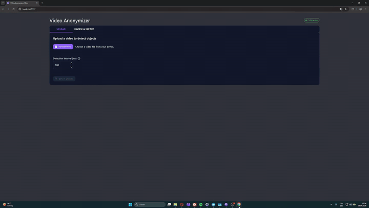

# VideoAnonymizer

**Local-first video anonymization for faces, built as a full-stack engineering project.**

VideoAnonymizer detects faces in videos, lets users review and correct every detection, and exports an anonymized copy with only the selected regions blurred. The editor combines a video preview, occurrence timelines, track controls, configurable blur and time-buffer settings, forward tracking, and persistent undo/redo. In the standalone and Docker variants, videos, detection results, editor corrections, settings, and exports stay on the user's machine instead of being uploaded to a remote service.

VideoAnonymizer is usable for face anonymization demos and local experimentation, but it is not yet a hardened production privacy product.

## Demo

### Workflow Demo



[Open or download the full size MP4 demo](https://raw.githubusercontent.com/Imagonix/VideoAnonymizer/refs/heads/main/docs/video/demovideo.mp4)

The demo shows the local workflow: select a video, analyze it, review detections in the editor, exclude a face from anonymization, export the selected detections, and play the result.

## Quickstart

The recommended way to run VideoAnonymizer is via Docker. It runs in standalone mode, and all data stays on your device.

Requirements: [Docker](https://docs.docker.com/engine/install/) and optionally [NVIDIA Container Toolkit](https://docs.nvidia.com/datacenter/cloud-native/container-toolkit/latest/install-guide.html) for GPU acceleration.

Update:
```bash
docker pull ghcr.io/imagonix/videoanonymizer-local:latest
```
Start with GPU:
```bash
docker run -d --name video-anonymizer -p 5117:5117 -v ./docker-data:/data --gpus all --restart unless-stopped ghcr.io/imagonix/videoanonymizer-local:latest
```
Start on CPU:
```bash
docker run -d --name video-anonymizer -p 5117:5117 -v ./docker-data:/data --restart unless-stopped ghcr.io/imagonix/videoanonymizer-local:latest
```

Open [http://localhost:5117](http://localhost:5117) after the container has started.

> **You are in control of your data:** Uploaded videos, detection results, and anonymized exports are stored in the `./docker-data/` directory on your host — nothing leaves your machine. See [Data Control & Cleanup](#data-control--cleanup) for how to inspect, or delete your data at any time.

See [docker/README.md](docker/README.md) for more details.

## Highlights

- local-first privacy workflow: raw videos stay on the user's machine
- full review and correction loop with occurrence and track timelines
- forward tracking with detections appearing in the editor as they are produced
- video-, track-, segment-, and occurrence-level anonymization controls
- persistent action history with undo/redo across page reloads
- Blazor + Vue integration for a rich video editor
- local persistence for imported videos, editor corrections, settings, and exports
- Python ONNX inference behind a .NET application
- standalone, Docker, and Aspire-based distributed modes
- CI pipeline for testing and packaged releases

## Current Scope

VideoAnonymizer currently focuses on **face anonymization**.

What works today:

- import a new video or reopen previously imported local videos
- sort imported videos by filename or upload time and delete a working copy after confirmation
- choose the frame-analysis interval before detection
- analyze frames with a Python object detection service
- detect faces using an ONNX model
- review detections as unblurred colored outlines in a video/timeline UI
- include or exclude individual occurrences or complete materialized tracks
- add, move, resize, delete, merge, split, and reassign detections
- track a selected occurrence forward, with streaming progress and incremental timeline updates
- configure blur shape and blur size, including track- and occurrence-level overrides
- configure video-wide time buffers, segment-boundary overrides, and gap interpolation
- persist editor corrections and anonymization settings as they change
- undo/redo persisted editor, tracking, and settings actions, including after a page reload
- export selected regions with interpolation/extrapolation and frame-edge clipping consistent with the preview
- download the completed export automatically or retry the latest completed download from the editor
- run via Docker on any OS, as a standalone local Windows package, or from source as a distributed Aspire app

Current limitations:

- face detection is the bundled and supported anonymization use case
- forward tracking may still require manual correction in difficult footage
- Windows releases are not signed and may trigger SmartScreen warnings

## Architecture

VideoAnonymizer supports a local-first architecture and a distributed architecture. The local-first architecture is delivered both as a Docker image and as a standalone Windows package; the distributed development setup is orchestrated with .NET Aspire.

### Standalone Mode

Video anonymization often touches private material. A local desktop workflow is useful when users do not want to upload raw footage to a cloud service just to remove faces.

Standalone mode keeps the full workflow on the user's machine while preserving the same product experience as the distributed setup. It bundles the web UI, API, video processing workers, object detection service, direct messaging, and local storage into one runtime.

In standalone mode:

- processing happens locally on the user's machine
- user videos are not sent to a remote backend
- metadata, detections, editor corrections, and blur settings are stored in a local SQLite database
- GPU acceleration is used when available, with CPU fallback supported
- Docker runs this mode cross-platform; the standalone Windows package uses the same local-first architecture

### Cloud-Ready Mode

The distributed variant keeps service boundaries explicit and is orchestrated with .NET Aspire:

- `webfrontend` - Blazor WebAssembly frontend
- `apiservice` - ASP.NET Core backend and SignalR notifications
- `video processor` - worker service for frame extraction, anonymization, and export
- `objectDetection` - Python FastAPI computer vision service
- `RabbitMQ` - asynchronous job queue
- `PostgreSQL` - distributed metadata and processing state
- `database migration service` - schema migration on startup

The two modes share the same application concepts while using different infrastructure adapters for persistence and messaging: SQLite/direct messaging in standalone and Docker mode, PostgreSQL/RabbitMQ in distributed mode.

## Processing Flow

1. The user selects a video.
2. The API creates an analysis job.
3. The video processor extracts frames.
4. Frames are sent to the Python detection service.
5. Detected faces are stored and displayed as occurrences grouped into materialized tracks.
6. The user includes or excludes regions and corrects them by adding, moving, resizing, deleting, merging, splitting, or reassigning detections.
7. Optionally, the user tracks an occurrence forward; detections are streamed through the worker, API, SignalR, and into the live timeline.
8. Editor actions and video-, track-, segment-, and occurrence-level settings are persisted immediately and added to the undo/redo history.
9. At export time, the processor resolves selected stored, interpolated, and extrapolated regions and applies the configured blur.
10. The completed video downloads automatically and remains available for a download retry.

## From Source Code

Requirements:

- .NET 10
- Python 3.10+
- Node.js/npm
- Docker
- GPU optional, recommended for faster inference
  - CUDA Toolkit 12.x and cuDNN 9.x for CUDA 12

### Build Standalone Package

```powershell
git clone https://github.com/Imagonix/VideoAnonymizer.git
cd VideoAnonymizer
.\publish-standalone.ps1
```

Output:

```text
artifacts/standalone/VideoAnonymizer.exe
```
The standalone package starts the app locally and opens the browser UI automatically.

### Distributed Development Setup

```powershell
git clone https://github.com/Imagonix/VideoAnonymizer.git
cd VideoAnonymizer
.\setup-dev.ps1
cd VideoAnonymizer.Web.Modules/ClientApp/video-editor
npm ci
npm run build
cd ../../..
dotnet run --project VideoAnonymizer.AppHost
```

This starts the Aspire application with frontend, API, RabbitMQ, PostgreSQL, workers, and Python object detection.

## Tech Stack

### Backend

- .NET 10
- ASP.NET Core
- Entity Framework Core
- SignalR
- RabbitMQ for distributed messaging
- direct messaging abstraction for standalone mode
- SQLite for standalone and Docker persistence
- PostgreSQL for distributed persistence

### Frontend

- Blazor WebAssembly
- Vue for the video review/editor component
- MudBlazor

### AI and Processing

- Python
- FastAPI
- ONNX Runtime
- bundled ONNX face detection model
- OpenCV / OpenCvSharp

### Infrastructure and Delivery

- .NET Aspire
- SQLite
- PostgreSQL
- RabbitMQ
- Docker
- PyInstaller for the Python object detection executable
- GitHub Actions for standalone packaging and prerelease artifacts

## AI Models

- Object detection uses ONNX models with sibling `*.detector.json` config files.
- The default face detector is bundled with the app.
- Compatible detector pairs can be loaded by copying `<name>.onnx` and `<name>.detector.json` into the local models folder, then restarting the app.
- Docker uses `./docker-data/models/`; standalone uses `data/models/` next to the app.

## Roadmap

In progress:

- improved forward-tracking robustness for difficult footage
- continued editor usability and performance improvements

Planned:

- release signing and packaging polish

## Project Purpose

VideoAnonymizer is built as a practical product-style reference project. It demonstrates how AI inference can be turned into a usable workflow with review, correction points, background processing, and export.

It is intended to show:

- privacy-aware product thinking
- full-stack .NET application development
- Python AI service integration
- distributed architecture with Aspire
- local standalone packaging
- pragmatic CI/CD and release automation

## Data Control & Cleanup

VideoAnonymizer is built local-first so you stay in full control of your data. Nothing is uploaded to any remote service.

### Where data is stored

| Mode | Storage location | What's there |
|---|---|---|
| **Docker** | `./docker-data/` on your host machine (mapped to `/data` in the container) | Source videos, anonymized exports, detector models, processing metadata, editor corrections, blur settings, and `videoanonymizer.db` |
| **Standalone** | `App_Data/` folder next to `VideoAnonymizer.exe` | Source videos, anonymized exports, processing metadata, editor corrections, blur settings, and `videoanonymizer.db` |
| **Development** | `VideoAnonymizer.ApiService/App_Data/Uploads/` and `/data` in the project directory | Videos and exports from local dev runs, detector models |

### How to clean up

- **Docker:** Stop the container, delete the `./docker-data/` directory (or just `./docker-data/App_Data/Uploads/` to keep local detector models), then restart. The folder structure is recreated automatically.
- **Standalone:** Delete the `App_Data/` folder next to the executable.
- **Development:** Delete `App_Data/` and `data/` from the repository root.

## License

MIT License
